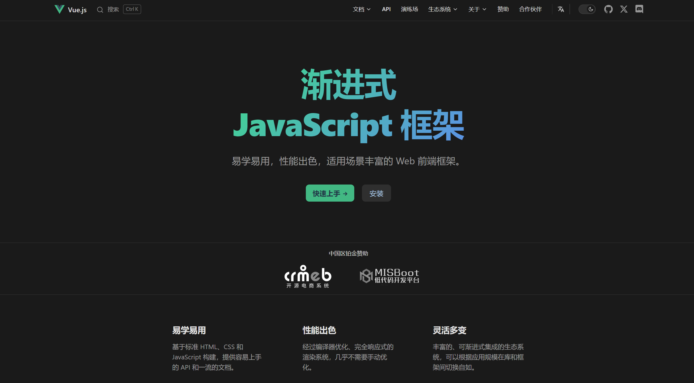
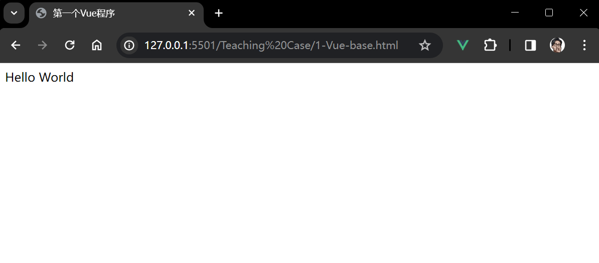
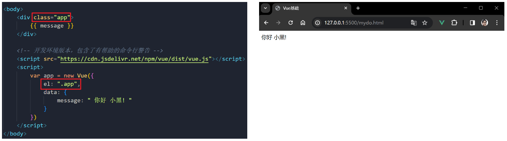
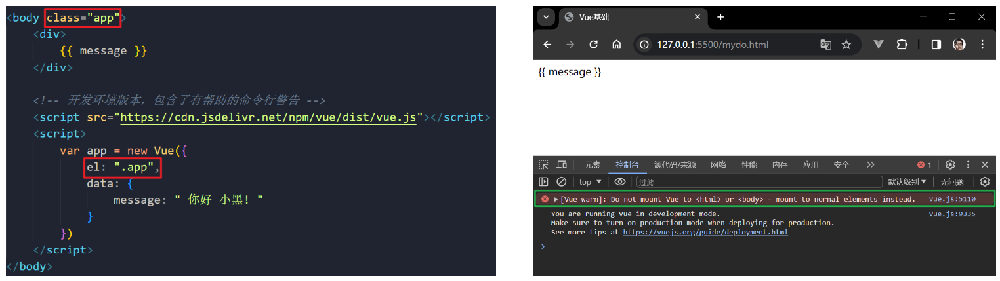
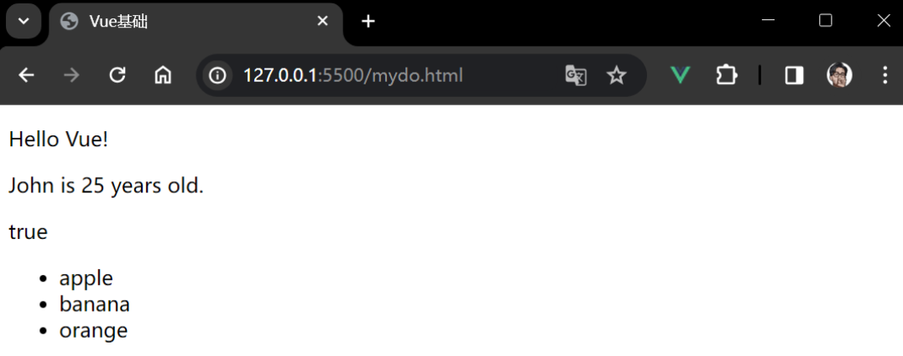
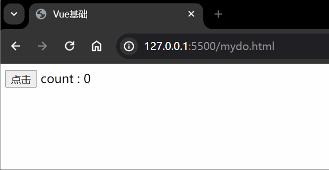
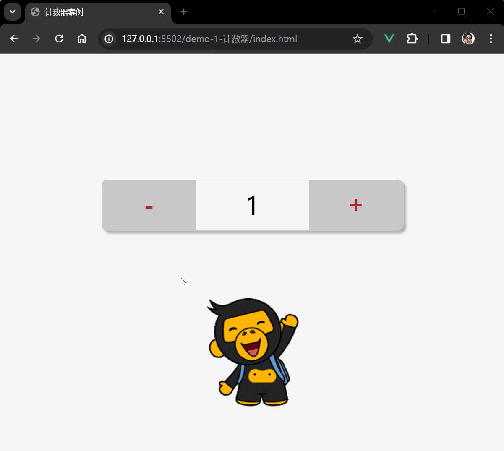

# VueQuickStart

> ## 目录
>
> - [一、前言](#一前言)
> - [二、内容](#二内容)
>   - [2.1 Vue 基础](#21-vue-基础)
>     - [（1）简介](#1简介)
>     - [（2）第一个 Vue 程序](#2第一个-vue-程序)
>     - [（3）el 挂载点](#3el-挂载点)
>     - [（4）data 数据](#4data-数据)
>   - [2.2 Vue 指令](#22-vue-指令)
>     - [（1）v-text](#1v-text--文本插值)
>     - [（2）v-html](#2v-html)
>     - [（3）v-on](#3v-on)
>   - [2.3 案例一：计数器](#23-案例一计数器)
>   - [2.4 Vue 指令](#24-vue-指令)
>     - [（1）v-show](#1v-show)
>     - [（2）v-if](#2v-if)
>     - [（3）v-bind](#3v-bind)


# 一、前言

> 本文档用于记录Vue的快速入门知识点。
>
> - 视频教程：[黑马程序员vue前端基础教程-4个小时带你快速入门vue](https://www.bilibili.com/video/BV12J411m7MG)

官方文档：[Vue.js - 渐进式 JavaScript 框架 | Vue.js](https://cn.vuejs.org/)




# 二、内容

## 2.1 Vue 基础

### （1）简介

`Vue`其实就是一个框架，也是一个生态。我们来看官方的定义：

> **Vue (发音为 /vjuː/，类似 view) 是一款用于构建用户界面的 JavaScript 框架。它基于标准 HTML、CSS 和 JavaScript 构建，并提供了一套声明式的、组件化的编程模型，帮助你高效地开发用户界面。无论是简单还是复杂的界面，Vue 都可以胜任**。

简单的说，`Vue` 是一款流行的前端 `JavaScript` 框架，它通过双向数据绑定将视图与数据模型关联起来。`Vue`主要特点是易学易用，具有高效的性能和扩展性，支持组件化开发，提供了丰富的指令和插件，能够快速构建交互丰富的`Web`应用程序。

`Vue`的核心是响应式系统，它能够自动追踪数据变化并更新视图。通过使用指令和组件，`Vue`提供了丰富的功能， 例如条件渲染、循环渲染、事件处理、样式绑定等。 `Vue`还提供了一套完整的路由和状态管理机制，可以帮助开发者更好地组织代码和管理状态。

---

**`Vue` 的两个核心功能**：

- **声明式渲染**：`Vue` 基于标准 `HTML` 拓展了一套模板语法，使得我们可以声明式地描述最终输出的 `HTML` 和 `JavaScript` 状态之间的关系。

- **响应性**：`Vue` 会自动跟踪 `JavaScript` 状态并在其发生变化时响应式地更新 `DOM`。

---

### （2）第一个 Vue 程序

示例代码：[Teaching Case/1-Vue-base.html](https://github.com/zheng-yi-yi/VueQuickStart/blob/main/Teaching%20Case/1-Vue-base.html)

```html
<!DOCTYPE html>
<html lang="en">

<head>
  <meta charset="UTF-8">
  <meta name="viewport" content="width=device-width, initial-scale=1.0">
  <meta http-equiv="X-UA-Compatible" content="ie=edge">
  <title>Vue基础</title>
</head>

<body>
  <div id="app">
    {{ message }}
  </div>
  <!-- 开发环境版本，包含了有帮助的命令行警告 -->
  <script src="https://cdn.jsdelivr.net/npm/vue/dist/vue.js"></script>
  <script>
    var app = new Vue({
      el: "#app",
      data: {
        message: "Hello World"
      }
    })
  </script>
</body>

</html>
```

效果如下：



以上是一个简单的 `Vue.js` 示例，知识要点如下：

```html
<div id="app">
  {{ message }}
</div>
```

这段代码在页面中创建一个具有`id`为`"app"`的`div`元素，用于 `Vue` 实例的挂载点。

双大括号 `{{ message }}` 是 `Vue` 的模板语法，表示在这个位置显示Vue实例中的 `message` 数据。

```javascript
<script src="https://cdn.jsdelivr.net/npm/vue/dist/vue.js"></script>
```

通过`CDN`引入`Vue.js`库，这里使用的是开发版本。

> - 开发版本（Unminified）：包含了详细的警告和调试信息，文件相对较大。这个版本适用于开发阶段，方便开发者进行调试和定位问题。
> - 生产版本（Minified）：经过压缩和优化，去除了警告和调试信息，文件体积较小。这个版本适用于部署到生产环境，以提高页面加载速度。
> 一般来说，在开发阶段使用开发版本进行调试和开发，而在部署到生产环境时使用生产版本以获得更好的性能和较小的文件体积。

```javascript
var app = new Vue({
  el: "#app",
  data: {
    message: "Hello World"
  }
})
```

- `var app = new Vue({})`：创建一个`Vue`实例对象，该实例对象包含`el`、`data`等属性。
- `el: "#app"`：指定`Vue`实例挂载到页面上的元素，这里是`id`为`"app"`的`div`。
- `data: { message: "Hello World" }`：定义`Vue`实例的数据，这里有一个名为`message`的数据项，初始值为`"Hello World"`。
整个流程是，Vue实例被创建并挂载到id为"app"的div上，然后模板语法`{{ message }}`会将`message`的值显示在页面上。

这个例子简单地演示了`Vue`的基本用法，通过数据绑定实现了页面内容的动态更新。

---


### （3）el 挂载点

`Vue`实例的作用范围主要由`el`选项指定，它表示`Vue`实例将挂载到哪个`DOM`元素上。`Vue`会管理这个指定的元素及其内部的后代元素。当`Vue`实例被创建并挂载后，它会对该`DOM`元素及其后代元素进行数据绑定和渲染。

`el` 选项的值可以是任何合法的`CSS`选择器。比如使用类选择器：



> 使用`ID`选择器是一种常见的做法，因为`ID`在`HTML`文档中是唯一的，这可以确保`Vue`实例只会挂载到页面上的特定元素上。

另外需要注意的是，我们不能将`Vue`实例挂载到`body`或 `html` 等根元素上。这是行不通的。




---


### （4）data 数据

> 示例代码：[Teaching Case/2-Vue-data.html](https://github.com/zheng-yi-yi/VueQuickStart/blob/main/Teaching%20Case/2-Vue-data.html)

在`Vue`实例中，我们使用`data`选项来定义数据。

`data`选项中定义的可以是任何`JavaScript`有效的数据类型，包括基本类型（如字符串、数字、布尔值等）和复杂类型 （如对象、数组等）。这些数据可以在模板中进行渲染，并通过`Vue`的响应式系统实现数据绑定。

举一个例子，我们定义如下数据：

```javascript
var app = new Vue({
    el: "#app",
    data: {
        message: 'Hello Vue!',
        number: 42,
        isActive: true,
        user: {
            name: 'John',
            age: 25
        },
        fruits: ['apple', 'banana', 'orange']
    }
});
```

页面如下：

```html
<div id="app">
    <p>{{ message }}</p>
    <p>{{ user.name }} is {{ user.age }} years old.</p>
    <p>{{ isActive }}</p>
    <ul>
        <li>{{ fruits[0] }}</li>
        <li>{{ fruits[1] }}</li>
        <li>{{ fruits[2] }}</li>
    </ul>
</div>
```



总的来说，在模板中渲染复杂类型数据时，遵循`JavaScript`语法即可。使用`{{ }}`插值语法来引用数据，使用`.`来访问对象的属性等。


## 2.2 Vue 指令

### （1）v-text | 文本插值

> **`v-text` 指令用于更新元素的文本内容**。


`v-text` 指令通过设置元素的 `textContent` 属性来工作，因此它将覆盖元素中所有现有的内容。

```html
<span v-text="msg"></span>
<!-- 等同于 -->
<span>{{msg}}</span>
```

后者使用 **“Mustache”** 语法（又称差值表达式，即双大括号`{{}}`），同样可以替换指定内容，同时每次 `msg` 属性更改时它也会同步更新。另外，指令内部支持写表达式。

---

### （2）v-html

> **`v-html`指令用于更新元素的 innerHTML**。


`v-html`指令的作用是设置元素的`innerHTML`，其内容中有`html`结构的话会被解析为相应标签，而 `v-text` 指令无论内容是什么，都只会解析为文本。

```html
<div v-html="html"></div>
```

需要注意的是，`v-html` 的内容直接作为普通 `HTML` 插入时，`Vue` 模板语法是不会被解析的。双大括号会将数据解释为纯文本，而不是 `HTML`。若想插入 `HTML` ，你需要使用 `v-html` 指令。

> 安全警告!
> 在网站上动态渲染任意 `HTML` 是非常危险的，因为这非常容易造成 `XSS` 漏洞。请仅在内容安全可信时再使用 `v-html`，并且永远不要使用用户提供的 `HTML` 内容。

---

### （3）v-on

> **`v-on` 指令用于给元素绑定事件监听器**。


`v-on` 指令的作用是为元素绑定事件。事件名不需要写`on`，同时，该指令可以简写为`@`。

注意，绑定的方法定义在`methods`属性中，方法内部通过`this`关键字访问定义在`data`中的数据。


举个例子：

```html
<div id="app">
    <button @click="doThis">点击</button> count : {{count}}
    <!-- 
        原始写法为：
        <button v-on:click="doThis"></button>
    -->
</div>
```

接着编写方法：

```javascript
var app = new Vue({
    el: "#app",
    data: {
        count: 0
    },
    methods: {
        doThis: function () {
            this.count++;
        }
    }
});
```

效果如下：



## 2.3 案例一：计数器

项目运行效果如下：



首先打开项目模板：[demo1-计数器-模板](https://github.com/zheng-yi-yi/VueQuickStart/blob/main/demo-1-计数器/template.html)，我们需要在这个模板的基础上进行修改完善。

首先解读该文档的结构：

```HTML
<div id="app">
    <!-- 计数器 -->
    <div class="input-num">
        <button @click="add">
            -
        </button>
        <span>{{  }}</span>
        <button @click="sub">
            +
        </button>
    </div>
    
</div>
```

1. **Vue实例挂载点**：
   1. 整个`Vue`应用的挂载点是`id`为"`app`"的`<div>`元素。
2. **计数器部分**：
   1. 计数器的相关内容包裹在一个具有类名"`input-num`"的`<div>`元素中。
   2. 两个按钮分别用于递增和递减计数器的值，通过`@click`指令绑定了`add`和`sub`两个方法。
   3. 计数器的当前值通过`{{  }}`插值语法绑定在`<span>`元素中，用于实时显示计数器的数值。
3. **图片**：
   1. 在计数器下方有一张图片，使用``标签引入。

```JavaScript
// 创建Vue实例
var app = new Vue({
    el: "#app",
    data: {
        num: 1
    },
    methods: {
        add: function () { },
        sub: function () { }
    }
});
```

可以看到，在Vue实例中：

- `el: "#app"` 定义了`Vue`实例将挂载到`HTML`中哪个元素上。在这里，`Vue`实例将挂载到`id`为"`app`"的`DOM`元素上。
- `data` 选项是一个对象，包含了`Vue`实例的响应式数据。在这里，只定义了一个属性 `num`，其初始值为`1`。这个值将被用于计数器的显示和修改。
- `methods` 选项是一个对象，包含了Vue实例中可以调用的方法。在这里，定义了两个空的方法 `add` 和 `sub`，用于后续实现递增和递减的逻辑。

---

OK，下面我们来完善这个模板。

首先，我们使用`Vue`的模板语法在页面上动态显示`Vue`实例中 `num` 数据的值。

```HTML
<span>{{ num }}</span>
```

这是`Vue`的插值语法，用于将`Vue`实例中的数据动态地渲染到模板。

> 通过这样的写法，当 `num` 的值在`Vue`实例中发生变化时，页面上对应的 `<span>` 元素会自动更新，反映最新的值。这种响应式的特性是`Vue`的核心之一，使得数据和视图能够保持同步。

接下来，我们来实现计数器的递增和递减逻辑。

```JavaScript
methods: {
  sub() {
    if (this.num > 0) {
      // 如果计数器的值大于0，则递减
      this.num--;
    } else {
      // 如果计数器的值已经为0，弹出提示
      alert("别点啦,到底啦!");
    }
  },
  add() {
    if (this.num < 10) {
      // 如果计数器的值小于10，则递增
      this.num++;
    } else {
      // 如果计数器的值已经为10，弹出提示
      alert("别点啦,到头啦!");
    }
  }
}
```

代码实现如下：

- 递减逻辑 (`sub` 方法)：
  - 首先，通过条件判断 `if (this.num > 0)` 检查计数器的值是否大于0。
  - 如果大于0，则执行 `this.num--`，即递减计数器的值。
  - 如果计数器的值已经为0，弹出一个警告提示。
- 递增逻辑 (`add` 方法)：
  - 同样地，通过条件判断 `if (this.num < 10)` 检查计数器的值是否小于10。
  - 如果小于10，则执行 `this.num++`，即递增计数器的值。
  - 如果计数器的值已经为10，弹出一个警告提示。

通过这两个方法，我们就实现了一个简单的计数器，同时加入了一些保护性的逻辑，确保计数器的值在规定的范围内。

完整代码：[demo1-计数器-案例](https://github.com/zheng-yi-yi/VueQuickStart/blob/main/demo-1-计数器/index.html)

## 2.4 Vue 指令

### （1）v-show

`v-show`指令可以根据表达值的真假来切换元素的显示和隐藏。其原理是通过设置内联样式 `display`属性来改变元素的可见性。

> 需要注意的是，`v-show` 不支持在 `<template>` 元素上使用，也不能和 `v-else` 搭配使用。

我们来看[案例代码](https://github.com/zheng-yi-yi/VueQuickStart/blob/main/Teaching%20Case/3-Vue-show.html)。

```HTML
<body>
    <div id="app">
        <input type="button" value="切换显示状态" @click="changeIsShow">
        <input type="button" value="累加年龄" @click="addAge">
        
        =18" src="../images/README/monkey.gif" alt="">
    </div>

    <!-- 1.开发环境版本，包含了有帮助的命令行警告 -->
    <script src="https://cdn.jsdelivr.net/npm/vue/dist/vue.js"></script>

    <script>
        var app = new Vue({
            el: "#app",
            data: {
                isShow: false,
                age: 17
            },
            methods: {
                changeIsShow: function () {
                    this.isShow = !this.isShow;
                },
                addAge: function () {
                    this.age++;
                }
            },
        })
    </script>
</body>
```

在上述代码中，我们使用了 `v-show` 指令来控制两个图片元素的显示状态。

具体的：

```HTML

```

这个图片元素的显示状态受到 `isShow` 数据属性的控制。

当 `isShow` 的值为 `true` 时，图片显示；当 `isShow` 的值为 `false` 时，图片隐藏。初始时，`isShow` 的值为 `false`，因此图片开始时是隐藏的。

```HTML
=18" src="../images/README/monkey.gif" alt="">
```

另一张图片元素的显示状态受到表达式 `age>=18` 的控制。如果 `age` 的值大于等于 18，图片显示；否则，图片隐藏。初始时，`age` 的值为 17，因此这个图片开始时是隐藏的。

接着，我们在在 `methods` 选项中定义了两个方法：

- `changeIsShow`：当按钮被点击时，调用此方法，反转 `isShow` 的值，从而切换第一个图片元素的显示状态。
- `addAge`：当按钮被点击时，调用此方法，将 `age` 的值加一，从而影响第二个图片元素的显示状态，将其显示。

### （2）v-if

和`v-show`指令类似，`v-if`指令是根据表达值的真假来切换元素的显示和隐藏，不同点在于，`v-if`指令是通过操作`dom`元素来实现的，表达式的值为`true`则元素存在于`dom`树中，渲染内容；为`false`则从`dom`树中移除。

> 具体的，当 `v-if` 元素被触发时，元素及其所包含的指令/组件都会销毁和重构。

简单来说，当初始条件为 `false `时，`v-if` 指令不会做任何事，其内容不会被渲染。相比之下，`v-show` 指令则是无论条件如何，其内容都会被渲染，只不过CSS `display` 属性会被切换。

因此，如果需要频繁切换，则使用`v-show`比较好，否则使用 `v-if` 更合适。

可参考[案例代码](https://github.com/zheng-yi-yi/VueQuickStart/blob/main/Teaching%20Case/4-Vue-if.html)。

### （3）v-bind

`v-bind`指令用于动态地绑定一个或多个属性，比如`src`、`title`和`class`等。

完整的写法是`v-bind:属性名`，简写形式是省略 `v-bind`，直接 `:属性名`即可。

```HTML
<div id="app">
    
</div>

<!-- 开发环境版本，包含了有帮助的命令行警告 -->
<script src="https://cdn.jsdelivr.net/npm/vue/dist/vue.js"></script>

<script>
    var app = new Vue({
        el: "#app",
        data: {
            imgSrc: "http://www.itheima.com/images/logo.png",
        }
    })
</script>
```

可以看到，这个图片元素的 `src` 属性被动态绑定到 Vue 实例中的 `imgSrc` 数据属性。即，图片的来源是由 `imgSrc` 决定的。简写的形式是 ``

```HTML
<div id="app">
    
    <br>
    
</div>

<!-- 开发环境版本，包含了有帮助的命令行警告 -->
<script src="https://cdn.jsdelivr.net/npm/vue/dist/vue.js"></script>

<script>
    var app = new Vue({
        el: "#app",
        data: {
            imgSrc: "http://www.itheima.com/images/logo.png",
            imgTitle: "黑马程序员",
            isActive: false
        },
        methods: {
            toggleActive: function () {
                this.isActive = !this.isActive;
            }
        },
    })
</script>
```

可以看到，`:title="imgTitle+'!!!'"`将图片的 `title` 属性绑定到由 `imgTitle` 和字符串 '!!!' 组成的表达式。另外，当我们点击后两张图片时，触发的方法`toggleActive`则用于改变 `isActive` 的值，从而实现类名的动态切换。通过对元素绑定 `class` 属性，根据 `isActive` 数据属性的值来决定是否添加类名 `active`。比较推荐使用对象的方式动态绑定类名，即 `:class="{active:isActive}"`。

参考[案例代码](https://github.com/zheng-yi-yi/VueQuickStart/blob/main/Teaching%20Case/5-Vue-bind.html)。
